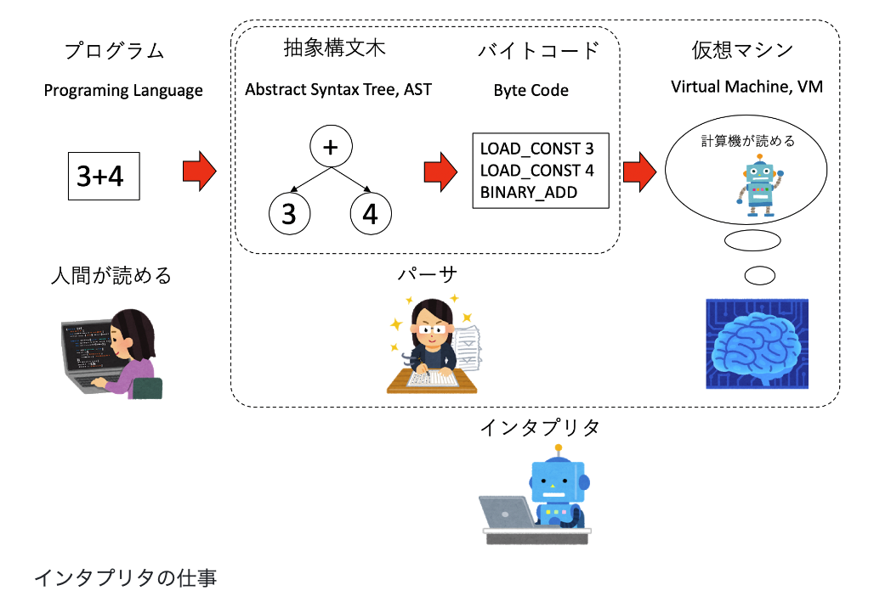

# STEP1 　一旦解く
``` python
class Solution:
    def detectCycle(self, head: Optional[ListNode]) -> Optional[ListNode]:
        checked = set()
        node = head
        while node is not None:

            if node in checked:
                return node

            checked.add(node)
            node = node.next
        
        return None
```

- かかった時間
    - 6m40s
- 計算量
    - 時間計算量
        - O(N)
        -　終端のノードまで毎回確認する。1回あたりsetのinの処理O(1)が走るので、N.
    - 空間計算量
        - O(N)
        - checkedに一個ずつnodeを確認しながら入れるので。
- コメント
  - 実は一回headをhaedとtypoしていてエラーになった。 submit前にテストケースを考えるだけではなくて、typoがないかも確認するようにしたい。
  - 前回のと大体同じ問題だったので、それほど困らず解けた。

# STEP2　他の人の解法を見て修正

### 2-1. leetcodeの回答

https://leetcode.com/problems/linked-list-cycle-ii/solutions/1701128/c-java-python-slow-and-fast-image-explanation-beginner-friendly/

``` python
class Solution(object):
    def detectCycle(self, head):
        slow = fast = head
        while fast and fast.next:
            slow, fast = slow.next, fast.next.next
            if slow == fast: break
        else: return None  # if not (fast and fast.next): return None
        while head != slow:
            head, slow = head.next, slow.next
        return head
```

if や else の後に改行がなくて読みづらく感じたので改行した。
``` python
class Solution(object):
    def detectCycle(self, head):
        slow = fast = head
        while fast and fast.next:
            slow, fast = slow.next, fast.next.next
            if slow == fast:
                break
        else:
            return None  # if not (fast and fast.next): return None
        while head != slow:
            head, slow = head.next, slow.next
        return head
```
- 改行しなくて良いのか調べた。
    - ~~PEP８を見て、直接この話題について議論されている箇所は見つけられなかったが、[別トピックのところ](https://pep8-ja.readthedocs.io/ja/latest/#id16)に下記の記載があったので、改行しないで一行で書くのは問題なさそう。~~　→やはり非推奨らしい。(詳細後述) ~~紛らわしいので、非推奨なら別トピックでも一行で書かないでくれたら良いのに。。~~

        ```python 
        # 正しい:
        if x == 4: print(x, y); x, y = y, x
        # 間違い:
        if x == 4 : print(x , y) ; x , y = y , x 
        ```
    - セミコロン
        - > 単純文とは、単一の論理行内に収められる文です。単一の行内には、複数の単純文をセミコロンで区切って入れることができます。単純文の構文は以下の通りです:
        - https://docs.python.org/ja/3/reference/simple_stmts.html#simple-statements
    - 追記:
        - やはり改行する方が推奨とのこと。 
            >複合文 (一行に複数の文を入れること) は一般的に推奨されません。:
            ```python
            # 正しい:
            if foo == 'blah':
                do_blah_thing()
            do_one()
            do_two()
            do_three()
            # 間違い:
            if foo == 'blah': do_blah_thing()
            do_one(); do_two(); do_three()
            ```
            - https://pep8-ja.readthedocs.io/ja/latest/#id17

- 計算量
    - 時間計算量
        - O(N)
            -  1つ目のwhile:輪っかがなくて最後のノードに辿り着く場合も、輪っかがあって追いつく場合も、Nに比例。
            - 2つ目のwhile:輪っかの始まりのノードまでの長さに比例。(Nよりは小さい)
    - 空間計算量
        - O(1)
            - ノードが増えても、覚えておく必要があるのは毎回の処理ごとにfast, slow, headがどこか、くらいなのでNに関係ない。


- whileの後にはelse節を書くことができる
    > 4.4. break 文と continue 文とループの else 節
        
        break 文は、その break 文を内包している最も内側にある for 文または while 文から抜け出すことができます。
        for 文と while 文では else 節を書くことができます。
        for 文の場合、 else 節はループ処理の最後の回が実行されたあとに実行されます。
        while 文の場合は、ループ条件が偽となったあとに実行されます。
        どちらのループ文でも、 break によってループ処理が終了したときは else 節は**実行されません**。
    - https://docs.python.org/ja/3/tutorial/controlflow.html#break-and-continue-statements-and-else-clauses-on-loops 


- 間に空行がなく、ギュッと詰まっているが、どんな時に空行を開けるべきなのかよくわかっていなかったので調べた。
    - 控え目に、とのことで厳密なルールはなさそうだった。
        >関数の中では、ロジックの境目を示すために、空行を控えめに使うようにします。
    - https://pep8-ja.readthedocs.io/ja/latest/#id11


### 2-2.他の人の回答
- [1つ目](https://github.com/canisterism/leetcode/pull/3)
    - 再帰でかけるらしい。元のコードはrubyだったのでchatGPTに手伝ってもらいながらpythonにした。

    ```python
    class Solution:
        def detectCycle(self, head: ListNode) -> Optional[ListNode]:
            visited_nodes = set()
            return self.check_node(head, visited_nodes)

        def check_node(self, node: ListNode, visited_nodes: set) -> Optional[ListNode]:
            if node is None:
                return None
            if node in visited_nodes:
                return node

            visited_nodes.add(node)
            return self.check_node(node.next, visited_nodes)
    ```  

    - 再帰の深さについて
        ```python
        import sys
        sys.getrecursionlimit()　　　　
        sys.setrecursionlimit(2000)
        ```　
    - sys.getrecursionlimit()
        >現在の最大再帰数を返します。最大再帰数は、Python インタプリタスタックの最大の深さです。この制限は Python プログラムが無限に再帰し、C スタックがオーバーフローしてクラッシュすることを防止するために設けられています。この値は setrecursionlimit() で指定することができます。
        - https://docs.python.org/ja/3/library/sys.html#sys.getrecursionlimit

    
    - pythonインタプリタのスタックとは


        -  https://kaityo256.github.io/python_zero/howtowork/index.html から引用
            - 

        - (前提)　コンパイル言語(notインタプリタ言語)では、下記の通り変換して機械に命令を伝える
            - プログラム　→　 抽象構文木　→ アセンブリ言語(ADD 3,4) →機械語(034)
            - 機械語：機械が解釈できる、数字だけからなる言葉。0に「足す」と言う意味をつけて「034」で3と４を足す。
            - アセンブリ言語：0は「足す」に一対一対応するなら034をADD 3, 4て書いた方がわかりやすい！と言う形で、一対一対応で変換した言語。

        - インタプリタは、「プログラム」をバイトコードにして、仮想マシンを使ってそれを実行する。その仮想マシンはメモリにスタックを用いる。
            - プログラム　→  抽象構文木　→ バイトコード 
        - プログラム：　3 + 4
        - バイトコード：　仮想的な機械向けの仮想的な機械語。バイトコードを実行するプログラムを「仮想マシン」という。
            ```
            LOAD_CONST 3
            LOAD_CONST 4
            BINARY_ADD
            ```
        - > メモリとしてスタックを用いるような計算機をスタックマシン (stack machine)と呼ぶ。Pythonの仮想マシンはスタックマシンである。
        -  > 既にみたように、スタックのデータのやりとりは「一番上」のみ、取り出せるデータも「最後に入れたもの」だけに限られ、途中にデータを挿入することも、任意の場所のデータを取り出すこともできない、いわば「不自由」なデータ構造である。なぜこのような「不自由」なデータ構造をメモリに採用しているかというと、命令セットが簡単になるというメリットがあるからである。
            我々が通常使っている計算機は「レジスタマシン」と呼ばれる方式を採用している。レジスタマシンは、レジスタという計算を行うための小さく高速な作業領域を複数持ち、メモリも任意の場所に読み書きできる。すると、当然のことながら「メモリのどこから、どのレジスタに値をロードし、計算結果をどこに書き込むか」を指定しなければならない。それに対して、スタックマシンはメモリの「入り口」と「出口」が決まっているため、例えば足し算をする命令BINARY_ADDは引数を必要としない。このように、スタックマシンは命令セットが単純になるというメリットがあり、仮想マシンのモデルとして広く採用されている。


    
    - スタックオーバーフロー　とは
        - > スタックオーバーフロー (英: stack overflow) は、コンピュータプログラムにおいて、コールスタック領域の限界を超えたデータプッシュにより発生する、バッファオーバーフローの一種である。スタックバッファオーバーフロー (英: stack buffer overflow) とは別の概念である。
            - https://ja.wikipedia.org/wiki/%E3%82%B9%E3%82%BF%E3%83%83%E3%82%AF%E3%82%AA%E3%83%BC%E3%83%90%E3%83%BC%E3%83%95%E3%83%AD%E3%83%BC

        - 要するに、スタックに積み上げられるものの数に上限がある、と言う話？

    - 今回は、深さが問題にならないのか
        - ノードを一つずつN個確認するので、深さはN
        - Nの数は最大10^4
            - > The number of the nodes in the list is in the range [0, 10^4]. 
        - leetcodeの環境でsys.getrecursionlimit()をどうやって実行したら良いのかわからなかった。
        - Solutionを作らないとSolutionがないと言われ、Solutionを作って下記のようにしても、wrong answerになってしまった。
        ```python
            class Solution:
                def detectCycle(self, head: ListNode) -> Optional[ListNode]:
                    print(sys.getrecursionlimit())
        ```
    - 計算量
        - 時間、空間ともにO(N)


<br>
<br>


# STEP3 　3回連続１０分以内に
- せっかくなので再帰をかけるように練習する
``` python
class Solution:
    def detectCycle(self, head: Optional[ListNode]) -> Optional[ListNode]:
        visited = set()
        return self.check_node(head, visited)

    def check_node(self, node: Optional[ListNode], visited: set) -> Optional[ListNode]:

        if node is None:
            return None
        if node in visited:
            return node

        visited.add(node)

        return self.check_node(node.next, visited)

```
- 所要時間2m12s
- コメント
    - スラスラかけるようになるまで結構時間がかかった。


# STEP4 レビューFBを踏まえて

- プライベートメソッド

    - クラス内部のみで使用してほしいメソッドのこと
        - 今回の例だと、check_nodeはdetectCycleの中だけで使って欲しい。
    - 慣習的にアンダースコアをメソッド名の前に1つつけることで、外から触らないでね、というメッセージとしている (が、外から使用できなくなるわけではなく、使えてしまう状態ではある)

    - 一方、アンダースコアをメソッド名の前に2つけると、裏で関数の名前を変換して、アクセスできないようになる。(変換後の名前を使えば無理やりアクセスはできる。)
        ``` python
        class Example:
        def public_method(self):
            self.__private_method()

        def __private_method(self):
            print("This is a private method")

        example = Example()
        example.public_method()  # => "This is a private method"
        example.__private_method()  # => AttributeError: 'Example' object has no attribute '__private_method'
        ```
    - >オブジェクトの中からしかアクセス出来ない "プライベート" インスタンス変数は、 Python にはありません。しかし、ほとんどの Python コードが従っている慣習があります。アンダースコアで始まる名前 (例えば _spam) は、 (関数であれメソッドであれデータメンバであれ) 非 public なAPIとして扱います。これらは、予告なく変更されるかもしれない実装の詳細として扱われるべきです。
    クラスのプライベートメンバについて適切なユースケース(特にサブクラスで定義された名前との衝突を避ける場合)があるので、名前マングリング (name mangling) と呼ばれる、限定されたサポート機構があります。 __spam (先頭に二個以上の下線文字、末尾に一個以下の下線文字) という形式の識別子は、 _classname__spam へとテキスト置換されるようになりました。ここで classname は、現在のクラス名から先頭の下線文字をはぎとった名前になります。このような難号化 (mangle) は、識別子の文法的な位置にかかわらず行われるので、クラス定義内に現れた識別子全てに対して実行されます。
    - https://docs.python.org/ja/3/tutorial/classes.html#private-variables
        - mangling
            - 1.〔切ったりたたいたりして～を〕ずたずたにする、めちゃくちゃにする、押しつぶす
            - 2. 〔下手な人が文章などを〕台無しにする、めちゃくちゃにする、駄目にする
                - https://eow.alc.co.jp/search?q=mangle

    - 結局アンダースコアは一つが良いのか二つが良いのか
        - → 基本、1つ
            - Python はアンダースコアが先頭に二つ付いた名前にクラス名を追加します。つまり、クラス Foo に __a という名前の属性があった場合、この名前は Foo.__a ではアクセスできません (どうしてもアクセスしたいユーザーは Foo._Foo__a とすればアクセスできます)。一般的には、アンダースコアを名前の先頭に二つ付けるやり方は、サブクラス化されるように設計されたクラスの属性が衝突したときに、それを避けるためだけに使うべきです。
             - https://pep8-ja.readthedocs.io/ja/latest/#id37

            - > サブクラス化して使うクラスがあるとします。サブクラスで使って欲しくない属性があった場合、その名前の最後ではなく、先頭にアンダースコアを二つ付けることを検討してみましょう。これによって Python のマングリングアルゴリズムが呼び出され、その属性にはクラス名が付加されます。これはサブクラスにうっかり同名の属性が入ってしまうことによる属性の衝突を避けるのに役立ちます。
                - https://pep8-ja.readthedocs.io/ja/latest/#id39


    - スタックオーバーフローにならない深さの上限
        - python
            - 1000回にデフォルトが設定されている。一応sys.setrecursionlimit()で変更可能だが、気軽にやるべきではない。
            - > デフォルトでは、関数呼び出しのネストが1000に達すると RecursionError が発生します。最大ネスト回数は、sys.setrecursionlimit で指定できます。

                >指定可能な最大再帰回数は実行環境や処理によって大きく変化するため、通常はsys.setrecursionlimit() の値は変更するべきではありません。しかし、再帰を利用すれば単純なアルゴリズムで行える処理などもあり、そういった場合には注意しながら最大再帰回数を変更する場合があります。しかし、このネストの深さは無制限に大きくできるわけではありません。大きくしすぎると、前述のスタック領域を使い果たし、スタックオーバーフローによるエラーが発生します。
                - https://www.python.jp/news/wnpython311/inline-function.html
        
        - javascript
            - > 大抵は 5000 くらいの深さまでは呼べるのだけれど、条件によっては 10 程度の深さで起こることもあり得る
                - http://nmi.jp/2023-12-04-Maximm-Call-Stack-Size-Exceeded
                - この記事だと、だから再帰は書くな、だが、こっちによると、ES6になれば末尾よびだし最適化があるから大丈夫とのこと
                    - https://qiita.com/pebblip/items/cf8d3230969b2f6b3132


        - コールスタックで何が起きているのかと、末尾よびだし最適化
            - https://qiita.com/pebblip/items/cf8d3230969b2f6b3132
                - コールスタックの状態遷移がわかりやすい↑
            - 再帰関数は深すぎるとスタックオーバーフローになる
                - 関数は自身の処理が終わるまで、コールスタックと言うスタックに入ったままになる
                - 再帰関数は自分の処理が終わる前に、もう一回別の引数で関数を実行し始めるので、どんどん溜まって溢れる
            - 「末尾呼び出し最適化」と言う、スタックオーバーフローを防ぐための技術がある
                - f(g(h()...)) のように入れ子になってる時、もしf()の返り値がg()そのものなら、gのこと考え始める時にはもうfのこと忘れて良いじゃん、と言うアイディア
                - 上記を実現するには、f()の返り値である末尾に、再帰関数そのものをおけば良い
                - そのようにコード書くと自動で最適化する、と言うコンパイラとかのコード最適化技術を、末尾呼び出し最適化と言う
            - 階乗を求める例
                - 末尾再帰ではない書き方
                    ```js
                    function factorial(n) {
                        if (n === 0) {
                            return 1;
                        }
                        return n * factorial(n - 1); 
                    }
                    ```
                    - 自分自身(g)をよびだした後に、nをかける必要があるのでgの処理に入った後でも、手前のfのことを覚えてないといけない。

                - 末尾再帰
                    ```js
                    function factorial(n) {
                        function factorialTailCall(n, accum) {
                            if (n === 0) {
                                return accum;
                            }
                            return factorialTailCall(n - 1, n * accum);
                        }
                        return factorialTailCall(n, 1);
                    }
                    ```
                    - gの処理に入ったら、hのことは忘れてても答えが出せる
                    - 変換のポイントは、演算結果を関数の引数として次の実行時に渡す感じで累積すること

   

        - pythonでの対応
            >末尾再帰最適化（Tail Call Optimization, TCO）は、再帰関数の呼び出しが関数の最後にある場合に、スタックフレームを再利用することで効率的に処理を行う手法です。これにより、再帰の深さが増してもスタックオーバーフローを防ぐことができます。~~しかし、Pythonでは標準で末尾再帰最適化がサポートされていません[2][3][4]。~~ → (追記)3.11からサポートされている様子。詳細後述。

            Pythonでの末尾再帰最適化

            Pythonでは末尾再帰最適化を直接サポートしていないため、デコレータを用いて擬似的に実現する方法が提案されています[1][2]。以下は、デコレータを用いた末尾再帰の実装例です。

            ```python
            from functools import wraps

            def tail_recursion(func):
                firstcall = True
                params = ((), {})
                result = func

                @wraps(func)
                def wrapper(*args, **kwd):
                    nonlocal firstcall, params, result
                    params = args, kwd
                    if firstcall:
                        firstcall = False
                        try:
                            while result is func:
                                result = func(*args, **kwd)
                                args, kwd = params
                        finally:
                            firstcall = True
                        return result
                    else:
                        return func
                return wrapper

            @tail_recursion
            def fact(n, acc=1):
                return fact(n-1, acc*n) if n > 0 else acc

            print(fact(10))  # 出力: 3628800
            ```

            このコードでは、`@tail_recursion`デコレータを用いて、関数が再帰的に呼び出される際にスタックを積み増さないようにしています。これにより、再帰の深さに関係なく実行が可能となります[1].

            ### 末尾再帰最適化の限界と代替手法

            Pythonでは末尾再帰最適化が自動的に行われないため、再帰が深くなるとスタックオーバーフローが発生する可能性があります。この問題を解決するために、メモ化（Memoization）を利用することもあります。メモ化は、計算結果をキャッシュして再利用することで、再帰呼び出しの回数を減らし、効率を向上させる手法です[3].

            Pythonの標準ライブラリには`functools.lru_cache`というデコレータがあり、これを利用することで簡単にメモ化を実現できます。

            ```python
            from functools import lru_cache

            @lru_cache(maxsize=None)
            def fib(n):
                if n < 2:
                    return n
                return fib(n-1) + fib(n-2)

            print(fib(100))  # 出力: 354224848179261915075
            ```

            このように、Pythonで末尾再帰を最適化するためには、デコレータを用いるか、メモ化を活用することが一般的です。

            Citations:
            [1] https://qiita.com/feelinguy/items/0d017c657c41a839c800
            [2] https://takegue.hatenablog.com/entry/2014/12/18/021137
            [3] https://blog.goo.ne.jp/cametan_42/e/982ec38cd0d5e952077c315e1fbdff52
            [4] https://detail.chiebukuro.yahoo.co.jp/qa/question_detail/q14254296944
            [5] https://nineties.hatenadiary.org/entry/20110124/1295875352

        - デコレータ
            - 別の関数を返す関数。
            - 一般的な利用例は、 classmethod() と staticmethod()
            - シンタックスシュガーと言う簡易的な記法を使って書くことができる。
                - 次の二つの定義は意味的に同じ。
                    ```py
                    @staticmethod
                    def f(arg):
                        ...
                    

                    def f(arg):
                            ...
                    f = staticmethod(f)
                    ```
            - https://docs.python.org/ja/3/glossary.html#term-decorator
            
        - シンタックスシュガー(糖衣構文)
            - >プログラミング言語において、読み書きのしやすさのために導入される書き方であり、複雑でわかりにくい書き方と全く同じ意味になるものを、よりシンプルでわかりやすい書き方で書くことができるもの
            - https://ja.wikipedia.org/wiki/%E7%B3%96%E8%A1%A3%E6%A7%8B%E6%96%87

        - @staticmethod、@classmethod
            - メソッドを静的メソッドやクラスメソッドにして返す。
                - https://docs.python.org/ja/3/library/functions.html#staticmethod
                - https://docs.python.org/ja/3/library/functions.html#classmethod
            

            - perplexityによる説明
                - Pythonのクラスメソッドと静的メソッドは、どちらもクラスに関連付けられたメソッドですが、それぞれの使い方と目的には違いがあります。

                ### クラスメソッド (`@classmethod`)

                - **定義方法**: クラスメソッドは`@classmethod`デコレーターを使って定義されます。
                - **引数**: 第一引数としてクラス自身を受け取るため、通常`cls`という名前を使います。
                - **アクセス**: クラスメソッドはクラス変数にアクセスしたり、クラスの状態を変更することができます。
                - **用途**: 主にクラス全体に影響を与えるような操作や、ファクトリメソッドとしてインスタンスを生成する際に使用されます。継承したクラスオブジェクトにもアクセスできるため、継承関係を考慮した設計に向いています[2][3][4].

                例
                ```py
                class Circle:
                    pi = 3.14159

                    def __init__(self, radius):
                        self.radius = radius

                    @classmethod
                    def from_diameter(cls, diameter):
                        """直径からCircleインスタンスを生成するファクトリメソッド"""
                        radius = diameter / 2
                        return cls(radius)

                    def area(self):
                        """円の面積を計算するメソッド"""
                        return self.pi * (self.radius ** 2)

                # 直径からCircleインスタンスを生成
                circle = Circle.from_diameter(10)

                # 面積を計算
                print(f"Circle with diameter 10 has area: {circle.area()}")  # 出力: Circle with diameter 10 has area: 78.53975

                ```

                ### 静的メソッド (`@staticmethod`)

                - **定義方法**: 静的メソッドは`@staticmethod`デコレーターを使って定義されます。
                - **引数**: 第一引数としてクラスやインスタンスを受け取らず、必要な引数のみを取ります。
                - **アクセス**: 静的メソッドはクラス変数やインスタンス変数にアクセスできません。
                - **用途**: クラスの状態に依存しない汎用的な処理を実装するのに適しており、クラスから直接呼び出すことができます。継承クラスで動作が変わらないときに使用されます[2][4][5].


                例
                ```py
                class MathOperations:
                    @staticmethod
                    def add(x, y):
                        return x + y
                    
                    @staticmethod
                    def multiply(x, y):
                        return x * y

                # 静的メソッドの呼び出し
                result_add = MathOperations.add(5, 3)
                result_multiply = MathOperations.multiply(5, 3)

                print(f"5 + 3 = {result_add}")         # 出力: 5 + 3 = 8
                print(f"5 * 3 = {result_multiply}")    # 出力: 5 * 3 = 15

                ```

                ### 違いのまとめ

                - **クラスメソッド**はクラスの状態を操作するために使用され、クラス変数にアクセス可能です。
                - **静的メソッド**はクラスやインスタンスの状態に依存しない処理を行うために使用され、クラスから直接呼び出されますが、クラス変数やインスタンス変数にはアクセスできません。

                これらの特性を理解することで、適切な場面でクラスメソッドと静的メソッドを使い分けることができます。

                Citations:
                [1] https://www.youtube.com/watch?v=FTa-QL4CQ4I
                [2] https://scrapbox.io/PythonOsaka/%E3%82%AF%E3%83%A9%E3%82%B9%E3%83%A1%E3%82%BD%E3%83%83%E3%83%89%E3%81%A8%E9%9D%99%E7%9A%84%E3%83%A1%E3%82%BD%E3%83%83%E3%83%89
                [3] https://qiita.com/1plus4/items/b37ec6ea90569ffdebfe
                [4] https://helve-blog.com/posts/python/python-staticmethod-classmethod/
                [5] https://it-for-pharma.com/python-classmethod%E3%81%A8staticmethod%E3%82%92%E4%BD%BF%E3%81%86%E6%84%8F%E5%91%B3%E3%82%92%E8%80%83%E3%81%88%E3%82%8B

    - ファクトリメソッド
        - デザインパターンの一つ.
        - いくつか記事を読んだが、まだ理解しきれていない気がする。そのうちリベンジ。

- python 3.11以降なら、(デコレータ使わずとも)末尾再帰が書けるようになっている
    - 今までは、再帰の末尾呼びたし最適化に対応していたなかったが、対応するようになった。
    - https://opaupafz2.hatenablog.com/entry/2022/09/17/185036

    - 3.11で入った修正の詳細はこちら
        - https://www.python.jp/news/wnpython311/inline-function.html#Python3.11%E3%81%AE%E6%9C%80%E5%A4%A7%E5%86%8D%E5%B8%B0%E5%9B%9E%E6%95%B0
        - C言語もわからないと、本当にpythonをわかったとはならないのかもしれない。

 

- レビューFB 反映版
``` python
class Solution:
    def detectCycle(self, head: Optional[ListNode]) -> Optional[ListNode]:
        visited = set()
        return self._check_node(head, visited)

    def _check_node(self, node: Optional[ListNode], visited: set) -> Optional[ListNode]:
        if node is None:
            return None
        if node in visited:
            return node

        visited.add(node)

        return self._check_node(node.next, visited)

```