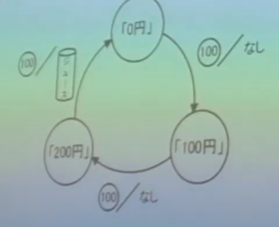

# 問題タイトル
問題リンク: https://leetcode.com/problems/valid-parentheses/description/

>Given a string s containing just the characters '(', ')', '{', '}', '[' and ']', determine if the input string is valid.
An input string is valid if:
Open brackets must be closed by the same type of brackets.
Open brackets must be closed in the correct order.
Every close bracket has a corresponding open bracket of the same type.

# STEP 1 自力で解く。

```py
class Solution:
    def isValid(self, s: str) -> bool:
        bracket_list = []
        for bracket in s:
            if bracket in {'(', '{', '['}: # これはdictのkeyなのかsetなのか考える
                bracket_list.append(bracket)
            
            # 右カッコの処理
            else:
                if len(bracket_list) < 1:
                    return False

                if bracket == ")":
                    partner = "("
                elif bracket == "}":
                    partner = "{"
                else:
                    partner = "["
                  
                tail = bracket_list.pop()
    
                if tail != partner:
                    return False      
                    
        if len(bracket_list) == 0:
            return True
        return False
```
- コメント
    - 何度かエラーを起こしながら、上記を書いた
        - 要素がなくてpopできない場合を考慮できてなかった
            - →pop書く時はいつもケアするようにする。
        - 右カッコの数が少なくて左カッコ消しきれないパターンを考慮できていなかった

-  ```{'(', '{', '['}```は、(想定通り)setとして宣言できてたのか、それともvalueのない辞書?として宣言になっていたのか
    - →setになってる。valueがない辞書、みたいなものはなさそう。
    - setの生成方法
        - 波括弧内にカンマ区切りで要素を列挙する: {'jack', 'sjoerd'}
        - 集合内包表記を使う: {c for c in 'abracadabra' if c not in 'abc'}
        - 型コンストラクタを使う: set(), set('foobar'), set(['a', 'b', 'foo'])
        - https://docs.python.org/ja/3/library/stdtypes.html#set-types-set-frozenset
    - 辞書の生成方法
        - 波括弧内にカンマ区切りで key: value 対を列挙する: {'jack': 4098, 'sjoerd': 4127} あるいは {4098: 'jack', 4127: 'sjoerd'}
        - 辞書内包表記を使う: {}, {x: x ** 2 for x in range(10)}
        - 型コンストラクタを使う: dict(), dict([('foo', 100), ('bar', 200)]), dict(foo=100, bar=200)
        - https://docs.python.org/ja/3/library/stdtypes.html#mapping-types-dict


- 所要時間
    計り忘れ。
　　
- 計算量
    sの長さをNとする。
    - 時間: O(N)
        - sの長さの分だけループする。ループの中での下記作業は全てO(1)。
            - set のin
            - listのappned
            - listのpop last
    - 空間: O(N)
        - bracket_listは全て左かっこの時一番要素が多くなって、N個の要素になりうる。


# STEP2 読みやすくする＆他の人の解法を見る
### 2_1.  正解を見てみる
- https://leetcode.com/problems/valid-parentheses/solutions/3399077/easy-solutions-in-java-python-and-c-look-at-once-with-exaplanation/

<details><summary>コード</summary>

```py
class Solution(object):
    def isValid(self, s):
        stack = [] 
        for c in s:
            if c in '([{':
                stack.append(c)
            else:
                if not stack or \
                    (c == ')' and stack[-1] != '(') or \
                    (c == '}' and stack[-1] != '{') or \
                    (c == ']' and stack[-1] != '['):
                    return False 
                stack.pop()
        return not stack

```
</details>


- 計算量
    - 時間:O(N)
        - sの長さの分だけループする。ループの中での作業は全てO(1)。
    - 空間:
        - stackはは全て左かっこの時一番要素が多くなって、N個の要素になりうる。

- コメント
    - 文字列だからsetにしなくてもinが使えたのは、思いつかなかった。3文字で長くないからsetのinの高速さもあまり関係なくて、こちらの方が短く記載できて良さそう。
    - ```return not stack```
        - コレクションは空だったらFalseだし、入ってたらTrueに真理値として判定される

        - >シーケンス (文字列, リスト, タプル) については、 空のシーケンスが False であることを利用しましょう。:
            ``` py
            # 正しい:
            if not seq:
            if seq:
            # 間違い:
            if len(seq):
            if not len(seq):
            ```
            - https://pep8-ja.readthedocs.io/ja/latest/#id41
        
        - > どのようなオブジェクトでも真理値として判定でき、 if や while の条件あるいは以下のブール演算の被演算子として使えます。オブジェクトは、デフォルトでは真と判定されます。ただし、そのクラスが __bool__() メソッドを定義していて False を返す場合、または __len__() メソッドを定義していてゼロを返す場合は偽と判定されます。 [1] 以下は偽と判定される主な組み込みオブジェクトです:
            
            >偽であると定義されている定数: None と False

            >数値型におけるゼロ: 0, 0.0, 0j, Decimal(0), Fraction(0, 1)

            >空のシーケンスまたはコレクション: '', (), [], {}, set(), range(0)
        - https://docs.python.org/ja/3/library/stdtypes.html#truth-value-testing

        - https://note.nkmk.me/python-bool-true-false-usage/
            - bool型はint型のサブクラス
            - bool型TrueとFalseは1, 0と等価
                -   ```py
                    print(True == 1)
                    # True
                    ```
                
            - 整数int型のサブクラスなので、普通に演算することも可能。
                -   ```py
                    print(True + True)
                    # 2
                    ```


### 2_2.別の人の解法
- https://github.com/rihib/leetcode/pull/23

- プッシュダウンオートマトン
    - > valid parentheses は、チョムスキー階層、タイプ-2、文脈自由文法だから、プッシュダウンオートマトンで書ける、を多分連想します。
これは、全部一つのことを言っていますが、これは常識です。
正規言語、正規文法、有限オートマトン、と対比されます。
    
    - https://discord.com/channels/1084280443945353267/1201211204547383386/1202541275115425822

- わからなかったので下記動画を見てまとめた。
    - https://www.youtube.com/watch?v=0xYl_-UuMQI
    - https://www.youtube.com/watch?v=iZr4eL0Idn8
    - https://www.youtube.com/watch?v=utsmu9Md5O8

- 形式言語
    - 自然言語やプログラミング言語を抽象化した概念。数学的に厳密な文法によって定義される。

- 形式文法G = (N,Σ,P,S)
    - 形式言語を定義するための規則などの組
    - N,Σ,P,Sの4つの情報を集めることで、文法Gを作る
        - S:開始記号(この記号から変換を始める)
        - P:生成規則の有限集合(変換ルール)
        - N:非終端記号の有限集合(まだ変換できるやつ)
        - Σ:終端記号の有限集合(この記号になったら変換を終わりにする)
    - Sからスタートして変換していって、変換ルールPを順に適用していって導ける終端記号の列の集まりを、文法Gが生成する言語L(G)と呼ぶ

- 正規文法
    - 特別な形式文法
        - 全ての生成規則がある3つパターンのどれかに当てはまるもの
            - S→ε(開始記号→空記号列)
            - A→a(非終端記号→終端記号)
            - A→aB(非終端記号→終端記号+非終端記号)
    - どんな正規文法Gに対しても、L(G)は正規表現（という表現の仕方）で表せる

- 正規言語
    - 正規表現で表現できる(=つまり正規文法で生成できる)言語のこと
- 文脈自由文法
    - 生成規則Pが全て、「非終端記号一つ→何でも」となっているもの。
    - Chomsky標準系というシンプルな形に変形できる

- 構文解析
    - 終端記号列から、逆にどうやって開始記号に戻るのか考える。(導出木を求める)
    - 赤い魚を食べる猫　はどっちが赤いのか。

- CKY法
    - 文脈自由文法の構文解析ができるアルゴリズム
    - 構文解析の結果、ちゃんと開始記号に戻れたら、その記号列がその文法によって導出できるということ
    - 「あるプログラムが、Pythonの言語の文法で書かれているかどうかの判定」とかができる。
    - 


- オートマトン(automaton)
    - https://www.youtube.com/watch?v=pLDcEO9VWks
    - 内部状態をもつ関数
        - 入力(お金)、状態(今まで投入されたお金総額)、出力(ジュースが出るか)
        - 
    - 複数形はautomata(ニーア・オートマタはここからか..電脳コイルも..)
    - オートマトンはyes(受理)かno(拒否)を返す（内部状態として累計入金額が300円になったら受理でジュースが出る）
    - 有限オートマトン→内部の状態が有限
    - 入力の100円玉をaという記号で表すと、入力はaaaやaaaaaaなど、aが3の倍数個並ぶ時に、yesの出力が出る
    - aaなどの記号(symbol)を並べたものを語(word)、yesの出力が出る語の集合を言語(Language)と呼ぶことにする。言語は数学的には集合。
    - 「あるオートマトンによって定められる言語とはどんなものか」「ある語がそのオートマトンによって受理されるか」というのが気になる
    - 英語の文法やC言語の文法のような文法は、それぞれ一定の基準を満たす語とそうでない語を識別するための道具であり、それぞれ一つの言語を定義していることになる。
    - (自販機の例みたいな)有限オートマトンは「メモリ」がいらないのが特徴。それに簡単なメモリであるプッシュダウンスタックを付け加えたものが、プッシュダウンオートマトン。これにより計算能力が向上する。
    - さらに使いやすいメモリを付け加えたものがチューリングマシン。今あるコンピュータはこれを真似して作っているので、今のコンピュータでできることはこの機械でもできるし、逆も然り。
    - 正規文法は有限オートマトンに対応していて、文脈自由文法はプッシュダウンオートマトンに対応している。

- オートマトンによる言語に含まれるかどうかの判定の仕方
    - https://www.momoyama-usagi.com/entry/info-automaton01
    - 

- 今回の問題を文脈自由文法として定義できるかやってみる。
    - 下記のルールで、validでないものも含めた言語を表現でき、これは文脈自由分布の定義を満たす。validなものはその部分集合であるため、これも同様にプッシュダウンオートマトンで書けるはず。
    - S:S
    - P:{ 
        - S→(,
        - S→),
        - S→{,
        - S→},
        - S→[,
        - S→],
        - S→(S,
        - S→)S,
        - S→{S,
        - S→}S,
        - S→[S,
        - S→]S,
    
        }
    - N:S
    - Σ:{(,),{,},[,]}

- プッシュダウンオートマトンとは
    - [こんな感じ](https://youtu.be/9AjuQLyGU70?list=PLJ8hceIamlnwK4J_9i-S23ckE-Wahu2qN&t=2217)(先程の講義号がシリーズの一部)の図で描いたり、使ったりできるもの。オートマトンの図にスタックが一つ追加されている。

- 再帰下降構文解析
    - 文脈自由文法に対する構文解析法の一つ
    - https://discord.com/channels/1084280443945353267/1235829049511903273/1238815737548898346
    

        <details><summary>Pythonにしたコード</summary>

        ```py
        # parens = ('(' parens ')' | '{' parens '}' | '[' parens ']')*
        class Solution:
            def isValid(self, s: str) -> bool:
                i = 0
                
                def consume(c):
                    nonlocal i
                    if i < len(s) and s[i] == c:
                        i += 1
                        return True
                    return False
                
                def parens():
                    while True:
                        if consume('('):
                            if not (parens() and consume(')')):
                                return False
                        elif consume('['):
                            if not (parens() and consume(']')):
                                return False
                        elif consume('{'):
                            if not (parens() and consume('}')):
                                return False
                        else:
                            return True
                
                return parens() and i == len(s)


        ```

        </details>
    -  動くのはわかったがbnfからこれを自力でサッと出せる気がしていないので、まだ何かわかっていないのだと思う。悔しいがいつかリベンジ。
    - 参考リンク集
        - https://blog.tiqwab.com/2017/01/04/recursive-descent-parser.html
        - https://qiita.com/thtitech/items/91e2456c989ca969850d
        - https://qiita.com/kazuki_tamaribuchi/items/77a4b4e6214646a079ed
        - https://ja.wikipedia.org/wiki/EBNF
        - https://qiita.com/7shi/items/64261a67081d49f941e3


# STEP3　　3回連続でエラーなしで解けるまで解く
<details><summary>コード</summary>
</details>
# STEP4 レビューFB反映