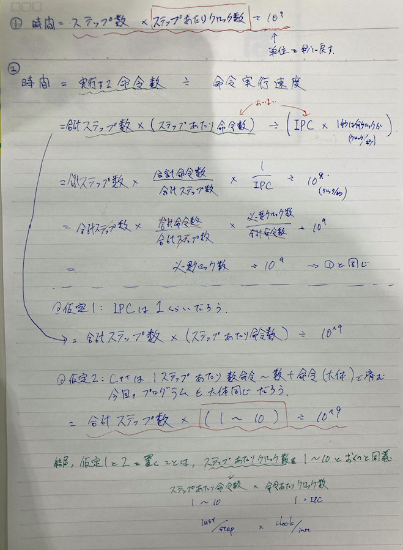
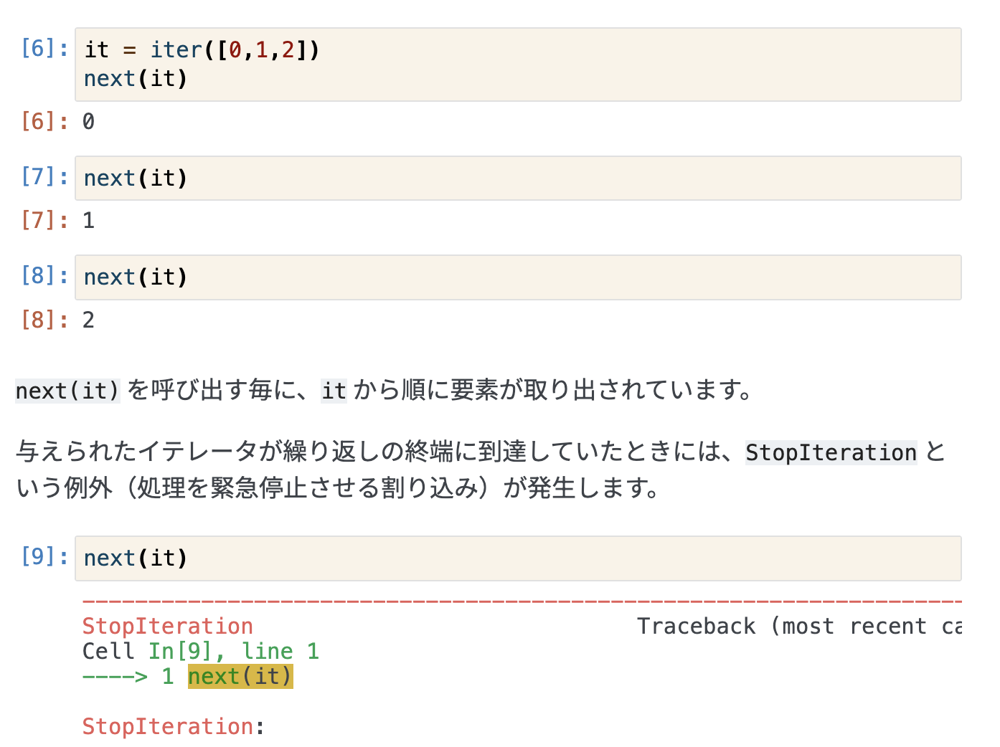
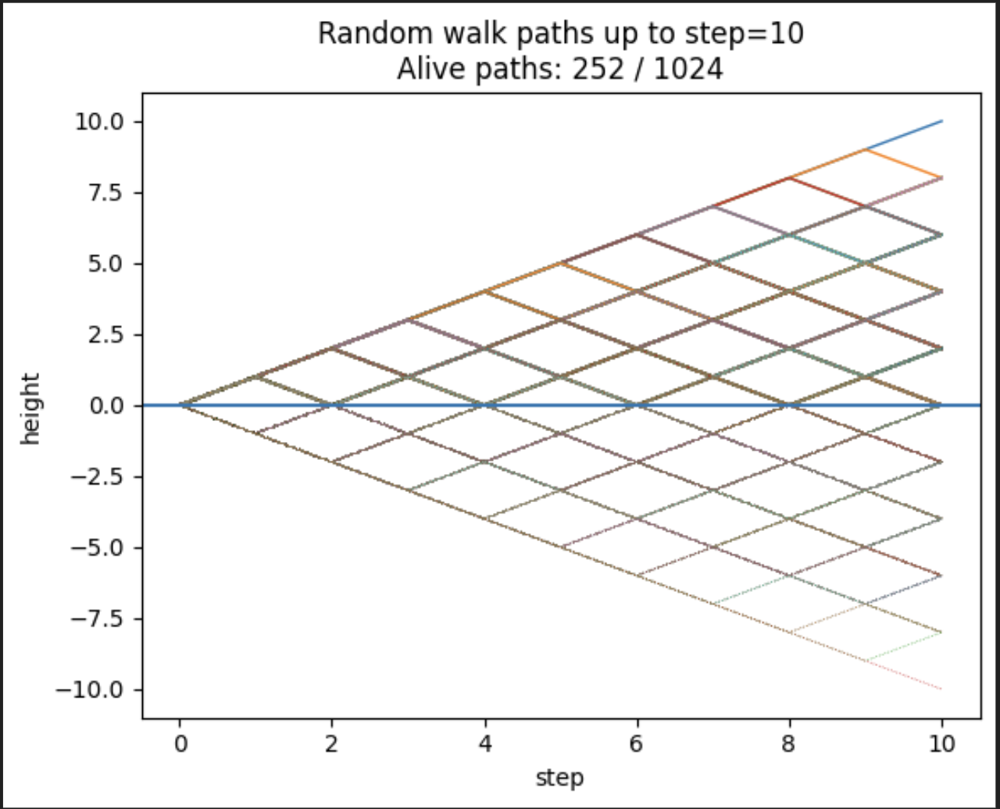

# 問題タイトル
[22. Generate Parentheses](https://leetcode.com/problems/generate-parentheses/description/)


# STEP 1 自力で解く。
```py
"""
左かっこ足すか、右かっこ足すかの二分木の樹形図を書いていく
もし右かっこの方が多くなったら、そこで打ち切り
最初の一個は必ず左

1分以内に終わるか
    深さ2n
    枝刈りのない二分木なら、末端ノードの数は2^2nで、全ノード数は2^(2n+1) - 1
    ノードごとの計算時間量はコピー程度なので、O(n)
    O(n * 2^(2n))
    n=8だと、８*2^16= 2^19 < 2^10 * 2^10 ≒ 10^6
    １秒10^6ステップ処理できるとすれば、十分
"""
class Solution:
    def generateParenthesis(self, n: int) -> List[str]:
        parentheses_and_left_surplus = [("(", 1)]
        result = []
        while parentheses_and_left_surplus:
            parentheses, left_surplus = parentheses_and_left_surplus.pop()
            if left_surplus < 0:
                continue
            if len(parentheses) == 2 * n:
                if left_surplus == 0:
                    result.append(parentheses)
                    continue # ここ忘れてエラーになった。
                else:
                    continue
            parentheses_and_left_surplus.append((parentheses + "(", left_surplus + 1))
            parentheses_and_left_surplus.append((parentheses + ")", left_surplus - 1))
        return result
```
- 最初continueを忘れてエラーになった。
- continueは二つに分けて書く必要なくて、一つににまとめられるな。


# STEP2 読みやすくする＆他の人の解法を見る
- https://github.com/hayashi-ay/leetcode/pull/70/files#diff-f09bc4caa2343f04592a1bdcc48b3303c4f95bfa6f334c126dc596850115384eR7
    -  parenthesesを文字列ではなく、配列で管理して、最後resultに入れるときに、`"".join`をしている
        - 私のSTEP1は一つカッコ足すたびに文字列全コピーが走って勿体無い、が、再帰関数で書いて適切にappend/popしないのであればコピーするしかないか？


- https://github.com/hayashi-ay/leetcode/pull/70/files#diff-f09bc4caa2343f04592a1bdcc48b3303c4f95bfa6f334c126dc596850115384eR151
    - 絶対に正しいものしか最初からstackに入れない
    - "("を足すのは、"("の数がn未満の時だけ
    - ")"を足すのは、num_open > num_close、つまり空いてるかっこが一つ以上存在する時だけ


- Generatorの活用
    - 下記のコードをgenerator使う形で書いている
    - ```py
        class Solution:
            def generateParenthesis(self, n: int) -> List[str]:
                result = []
                parenthesis = []
                def recursion(num_open_left, num_close_left): # TODO change function name
                    if num_open_left == 0 and num_close_left == 0:
                        result.append("".join(parenthesis))
                    if num_open_left > 0:
                        parenthesis.append("(")
                        recursion(num_open_left - 1, num_close_left)
                        parenthesis.pop()
                    if num_close_left > num_open_left:
                        parenthesis.append(")")
                        recursion(num_open_left, num_close_left - 1)
                        parenthesis.pop()

                recursion(n,n)
                return result

        ```
    - https://github.com/nittoco/leetcode/pull/43#discussion_r1913427084
        - >Generator のいいところとして、すべて使わないときに計算を省略できるとか中間のメモリーが軽くなることがあるなどはあるでしょう。
        - なるほど。


- https://github.com/fhiyo/leetcode/pull/53/files#r1714137722
    - 計算時間の見積もり
    - O(4^n/(sqrt(n)))になるとのこと。

- https://docs.google.com/document/d/11HV35ADPo9QxJOpJQ24FcZvtvioli770WWdZZDaLOfg/edit?tab=t.0#heading=h.8apk7fkyumae
    - 必要計算時間の見積もりの典型コメント集
    - 大きく分けて2通り紹介されている(が、本質的には同じ)
        - 1. 時間　＝　ステップ数　x ステップあたりクロック数　÷ 1秒あたりクロック数
            - 最後の1秒あたりクロック数は、1Ghzとして、10^9
            - ここに言語ごとの速度差をかける
                - Pythonだったらインタプリタのオーバーヘッドでc+=より100倍くらい遅いので、100かける
            - ステップあたりのクロック数は、どういう命令がありそうかをみつつ判断。難しめ。

        - 2. 時間　＝　ステップ数　÷ (10^8 ~ 10^9)
            - 元は、こう
                時間　＝　ステップ数　x　(ステップあたり命令数　x 命令あたりクロック数)　÷ 1秒あたりクロック数
            - 1の「ステップあたりクロック数」を、分解してるだけ。
            - さらに、それぞれにおおよその数字を代入
                - ステップあたり命令数: 1 ~ 10
                    - これは、厳密にはプログラムの内容によるが、C++なら大体これくらいでしょう、という数字
                    - 足して、比較して、ジャンプして、を10数個込み合わせれば、大体1ステップは実現できるでしょう、という感じ？
                - 命令あたりクロック数(IPC): 1
                    - 妥当性
                        - 昔のシンプルなCPUでは、ほとんど1~数クロックで、まれに10倍以上かかるものがある
                            レジスタ同士の加算　1クロック
                            レジスタ比較　1クロック
                            メモリアクセス　数クロック
                            乗算、除算　数十クロック
                            - https://www.agner.org/optimize/instruction_tables.pdf
                        - 今はパイプラインで複数命令が同時進行したりするので、加算でも0.xとかでできたりもして、正確に見積もるのは難しい。
                        - ざーっくり1、と置いても、見積もるにはそこまで支障が出ないのではないか、という数字?
            - 代入した結果、最初の式になる
            - もちろんこちらも言語ごとの速度差をかける

    - 整理した時のメモ
        - 


- https://discord.com/channels/1084280443945353267/1252267683731345438/1252591437485441024
    - 変数名などを好みに変えたもの↓
    - ```py
        class Solution:
            """
            validなカッコは、()の中か尻尾にvaildなもの足して作られるはずだよね、と考える。
            完成形は必ず(A)Bという形に分解できるのだから、逆にこの作り方でできるもの全部作れば網羅できる、という思考。
            """
            def __init__(self):
                self.num_pairs_to_parenthesis_list: Dict[int, List[str]] = {}

            def generateParenthesis(self, n: int) -> List[str]:
                if n == 0:
                    return [""]

                if n in self.num_pairs_to_parenthesis_list:
                    return self.num_pairs_to_parenthesis_list[n]

                results = []

                # 最初の () の「中」と「後ろ」に何組ずつ使うかを決める
                for inner_pair_num in range(n):
                    tail_pair_num = n - 1 - inner_pair_num
                    inners = self.generateParenthesis(inner_pair_num)
                    tails = self.generateParenthesis(tail_pair_num)
                    for inner in inners:
                        for tail in tails:
                            results.append(f"({inner})" + tail)

                self.num_pairs_to_parenthesis_list[n] = results
                return results
        ```
    - バックトラッキングじゃなくて、普通のメモ付き再帰になってる。全然思いつかなかった方法だったので、感動。
        - ` dp[n] = Σ ( "(" + dp[i] + ")" + dp[n-1-i] )`
    - >キャシュした内容を呼び出し元に破壊される可能性がありますね。
        ```py 
        result1 = generateParenthesis(3) # result1は、関数の中でresultsが指していた配列。そしてキャッシュ[3]もそれを指している
        result1.append("hoge")　# この時点で、キャッシュの方も壊れる
        reult2 = generateParenthesis(3) # 誤った結果に。
        ```
        - returnする前にコピーしてからreturnすれば、一旦解決
        - ただしそれだと、functools.cacheは使えないので、こうする↓
            - ```py
                from functools import cache
                class Solution:
                    @cache
                    def _generate(self, n: int) -> Tuple[str, ...]:
                        if n == 0:
                            return ("",)
                        tmp_results = []
                        for inner_pair_num in range(n):
                            tail_pair_num = n - 1 - inner_pair_num
                            inners = self.generateParenthesis(inner_pair_num)
                            tails = self.generateParenthesis(tail_pair_num)
                            for inner in inners:
                                for tail in tails:
                                    tmp_results.append(f"({inner})" + tail)
                        return tuple(tmp_results)

                    def generateParenthesis(self, n: int) -> List[str]:
                        return list(self._generate(n))
            ```
        - tupleはappend使えないので、一旦リストで作ってからtupleに変換(または　tuple1 + tuple2 で新たに作成)
        - tupleの型ヒントの書き方 
            > For tuples of variable size, we use one type and ellipsis
            `x: tuple[int, ...] = (1, 2, 3)  # Python 3.9+`
            - https://mypy.readthedocs.io/en/stable/cheat_sheet_py3.html#:~:text=%23%20For%20tuples%20of%20variable%20size%2C%20we%20use%20one%20type%20and%20ellipsis%0Ax%3A%20tuple%5Bint%2C%20...%5D%20%3D%20(1%2C%202%2C%203)%20%20%23%20Python%203.9%2B


- Generatorのキャッシュ
    - https://discord.com/channels/1084280443945353267/1226508154833993788/1328391771419578539
        - なぜ@cacheを使えないのか
            - そもそもgeneratorは何を返してるのか
                - >When a generator function is called, it returns an iterator known as a generator. 
                    - https://docs.python.org/3/reference/expressions.html#yield-expressions:~:text=When%20a%20generator%20function%20is%20called%2C%20it%20returns%20an%20iterator%20known%20as%20a%20generator.
                - >A function which returns a generator iterator. 
                - https://docs.python.org/3/glossary.html#term-generator
            - iteratorとは何か
                - https://docs.python.org/ja/3/glossary.html#term-iterator
                    - >データの流れを表現するオブジェクトです
                - https://docs.python.org/3.13/library/stdtypes.html#iterator-types
                - pythonはコンテナに対するイテレーション(反復処理)という概念をサポートしている。
                    - コンテナ:dict, list, set, tupleとか。
                        - >汎用の Python 組み込みコンテナ dict, list, set, および tuple に代わる、特殊なコンテナデータ型を実装しています。
                        - https://docs.python.org/ja/3.13/library/collections.html#module-collections
                - あるコンテナオブジェクトがイテレーション可能である(=イテラブルである)には、そのコンテナオブジェクトに`container.__iter__()`が実装されている必要がある。
                    - `container.__iter__()`はiteratorオブジェクトを返す。
                    - つまり、`__iter__() `を持つコンテナオブジェクトが、イテラブル。
                - iteratorオブジェクトは、下記二つのメソッドを持っている必要があり、これをiterator protocolと呼ぶ。
                    - `iterator.__iter__()`
                        - iteratorオブジェクト自体を返す。for文がコンテナに対してもイテレータに対しても同じように書けるようにするために必要。
                    - `iterator.__next__()`
                        - iteratorの次の要素を返す。それ以上アイテムがなければ、StopIteration例外を返す。
                - つまり、`__iter__()`と`__next__()`を持つ

            - 組み込み関数iter()
                - `iter(obj)`は内部的には、`obj.__iter__()`を実行する。
                - 余談
                    - `len(obj)`も`obj.__len__()`を実行している。
                - こういうものを特殊メソッドと呼ぶ
                    - https://docs.python.org/ja/3.13/reference/datamodel.html#special-method-names
                    - >クラスは、特殊な名前のメソッドを定義して、特殊な構文 (算術演算や添え字表記、スライス表記など) による特定の演算を実装できます。これは、Python の演算子オーバロード (operator overloading) へのアプローチです。これにより、クラスは言語の演算子に対する独自の振る舞いを定義できます。
            

            - https://utokyo-ipp.github.io/4/4-2.html
                >for文によって繰り返すことができるオブジェクトのことを総称して、イテラブル (iterable) と呼びます。
                >for文が、様々なデータ型をイテラブルとして統一的に扱えるのは、繰り返して取り出す操作を表現するイテレータ (iterator) を経由するからです。
                >itaratorは繰り返すもの（反復子とも呼ばれる）、iterableは繰り返すことができるもの、という意味
                >組み込み関数 iter は、イテラブルからイテレータを作ります。たとえば、
                    `it = iter([0,1,2])`
                 この it は、0 1 2 を順に取り出すイテレータです。

            - [next](https://utokyo-ipp.github.io/4/4-2.html#next)
                - >組み込み関数 next は、イテレータに対して繰り返しを1回分先に進める操作を与えます。
                - 

            - [for文の仕組み](https://utokyo-ipp.github.io/4/4-2.html#for%E6%96%87%E3%81%AE%E4%BB%95%E7%B5%84%E3%81%BF)
                - ```py
                    for x in [0,1,2]:
                        print(x)
                  ```
                - 上記のfor文は下記と同じ
                    ```py
                    try:
                        it = iter([0,1,2])
                        while True:
                            x = next(it)
                            print(x)
                    except StopIteration:
                        pass
                    ```

                - iteratorはデータの流れを表すオブジェクト
                - iteratorは特殊なイテラブル
                    - 1つのfor文で使い切りのイテラブル
                        - 
                        ```py
                            it = iter([0,1,2])
                            for x in it:
                                print(x) #0,1,2
                            for x in it:
                                print('これは実行されない')
                        ```
                        - 1回目のループで使い切ってしまったので、2回目は実現されない
                        - 詳細
                            - 1回目のfor文の完了時点でnext(it)はStopIterationを返す状態。
                            - 二回目のループでは、最初からStopIterationを返す状態なのでpassする。
                    - つまり、iteratorはイテラブルであることに加え、「どこまで使ったか」も覚えている

                - イテラブル
                    -  __iter__ メソッドを持つ(イテレータを作って返す)
                - イテレータ
                    - __iter__ メソッドを持つ(受け取ったイテレータをそのまま返す)
                    - __next__ を持つ

            - generatorは一回使うと空になって、なくなってしまう
                ```py
                from functools import cache
                @cache
                def gen(n):
                    for i in range(n):
                        yield i
                g = gen(3)
                print("first list:", list(g))
                print("second list:", list(g))
                ```
                ```
                first list: [0, 1, 2]
                second list: []
                ```
            - つまり、cacheのバリューとして、イミュータブルではないもの(generator iterator)を保存してしまうので、先ほどリストを保存していたときとと同じように、後から壊すことができてしまう。
            - コピーして保存すれば良いのでは
                - それもできない
                - generator は「値」じゃなくて「実行途中の関数」。Python では 実行途中の関数の状態を複製する手段が存在しない。
                - ```py
                    def gen():
                        yield 1
                        yield 2
                        yield 3

                   ```
                - こんなgeneratorがあったとして、「今まさに yield 2 の直前で止まってる、この状態を丸ごと複製したい」としたくてもできない。


        - ではこのコードはどうやってキャッシュしているのか
            - `@generator_cache`という自作のデコレータを作っている。
                - >(デコレータ) 別の関数を返す関数で、通常、 @wrapper 構文で関数変換として適用されます。
                - https://docs.python.org/ja/3.13/glossary.html#term-decorator
            - デコレータって自分で作るの初めて見たな。関数を返す関数でしかないのか。
            - generatorをコピーできないから、代わりにteeでコピーと同じようなことをしている。

            - tee(it, n)
                - 1つのgenerator(本来使い切りのもの)を複数人で使いたい時の工夫
                - generatorはコピーできない(詳細後記)ため、特別な工夫が必要
                - generatorっぽい偽物(_teeオブジェクト)を配って、それを代わりに使ってもらう
                    - `it1, it2 = tee(gen())`をすると、it1, ot2には_teeオブジェクトという偽イテレータのようなものが入る。
                - 偽物が満たすべき性能
                    - 本物や他の偽物に影響しない
                    - next()ができる
                - アイディア
                    - 最初の人が本物のgeneratorから取り出した時に、別の場所に保存しておいて、後続の人はそちらを参照する
                    - 保存する入れ物には、マトリョーシカのような配列を使う
                - イメージ
                    - generator: [A, B, C]
                    - マトリョーシカ: 
                        - [None, None] 最初
                        - [A, [None, None]] Aを取り出した後
                        - [A, [B, [None, None]]]
                        - [A, [B, [C, [None, None]]]]
                    - _teeオブジェクト
                        -  それぞれの_teeは、大元のgenerator(自分が先頭になった時に使う)と、今自分がどこの箱を見ているのかの情報を持っている。
                        -  ```py
                            class _tee:
                                self.iterator  # 元の generator（共有）
                                self.link      # 「今読む箱」を指すポインタ
                            ```
                            [value, next_box]という長さ2の箱、と捉えたときに、どの箱を今読むか、を.linkで指している
                            ```
                                [A, [B, [None, None]]]
                                 ↑        ↑
                                tee1     tee2
                            ```
                    
                - tee('ABC', 2) → A B C, A B C
                - >it1, it2, … itn splits one iterator into n
                - https://docs.python.org/3/library/itertools.html#:~:text=it1%2C%20it2%2C%20%E2%80%A6%20itn%20splits%20one%20iterator%20into%20n
                
                - teeは下記の実装と同じ、とのこと
                    - https://docs.python.org/3/library/itertools.html#itertools.tee:~:text=def%20tee(,link%0A%20%20%20%20%20%20%20%20return%20value


                    

- https://discord.com/channels/1084280443945353267/1339428945845555252/1381993770840756226
    - fn: sbと呼ばれるリストを受け取り、sbの中身に、ある一つの有効カッコをappendで追記する関数(使用カッコ組数はn)
    - mypyで関数
        - >he type of a function that accepts arguments A1, …, An and returns Rt is Callable[[A1, ..., An], Rt].
        - https://mypy.readthedocs.io/en/stable/kinds_of_types.html#callable-types-and-lambdas

- https://github.com/skypenguins/coding-practice/pull/27#discussion_r2533462366
    - 再構築と速度
    - 再構築
        - path + ["("]だと、リスト同士の足し算で、再構築になって結局遅い
        - append/popにすれば再構築にならないが、その場合再帰関数で書かないといけない(stackで再帰完全再現で書くのは大変)
        - `[path, "("]`という形でもてば、要素数はどれだけ伸びても2なので、コピー量がO(1)で済む
    - 速度
        - 樹形図の根本から遠いノードの方が、ノードあたりの計算コストが高い。
        - しかしそういったノードは少ない(根本から遠いほど少なくなる)
            - 直感的な理由
                - "("と")"を+1,-1に対応させて、ランダムウォークさせたとき、1回も0未満にならないものが、今回考えるノードたち。
                - step=kがおおきくなると、一回も0を下回らないで生き残り続けるやつはほぼいなくなる。  
                    - 図で見ると一見半分に見えるが、途中で0下回って這い上がってくるコースが実は全部アウトなことを考えると、確かに、生き残るものが少なさそうなのは直感的にわかる
                    - 「ルーレットで赤に1枚ずつかける」を、ずーっとやってても生き残れる人は少ない。
                - 
                - ちなみに、生き残るものの数は　1/√k になるらしい。LLMの解説を聞いたが、難しいので、一旦パス。

# STEP3　　3回連続でエラーなしで解けるまで解く


```py
class Solution:
    def generateParenthesis(self, n: int) -> List[str]:
        result = []
        stack = [("(", 1, 0)]
        while stack:
            parentheses, num_open, num_close = stack.pop()
            if num_open == n and num_close == n:
                result.append(parentheses)
                continue
            if num_open < n:
                stack.append((parentheses + "(", num_open + 1, num_close))
            if num_open > num_close:
                stack.append((parentheses + ")", num_open, num_close + 1))
        return result

```
stackは名前変えても良いかなと思ったが、3つも要素が入っていて変数名長くなるので、stackのままにした。


# STEP4 レビューFB反映