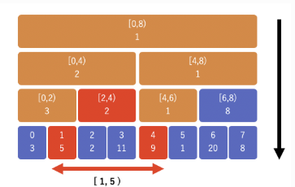

# 問題タイトル
300. Longest Increasing Subsequence
https://leetcode.com/problems/longest-increasing-subsequence/description/


# STEP 1 自力で解く。
```py
class Solution:
    def lengthOfLIS(self, nums: List[int]) -> int:
        dp = [1] * len(nums) 
        for i in range(len(nums)):
            for j in range(i):
                if nums[i] > nums[j]:
                    dp[i] = max(dp[i], dp[j] + 1)
        return max(dp)

```
- もっと効率よく解かなきゃいけないと思って、わからないなと思って答えを見たら、愚直に自分より前のもの全部見ていた。
    - n=10^3くらいだったらn^2でも10^6なので、1秒くらいで終わるのか。
    - どれくらいのサイズ感なのか意識したり、とりあえず効率悪そうなのでもざっくり解き方整理して時間どれくらいかかるのか考えなければ。
- dpは変えた方が良さそう。
    - lis_length_if_end_is_index かな？

# STEP2 読みやすくする＆他の人の解法を見る
-https://leetcode.com/problems/longest-increasing-subsequence/solutions/1326308/c-python-dp-binary-search-bit-segment-tree-solutions-picture-explain-o-nlogn/

solution2. ソリティア的解法
```py
class Solution:
    def lengthOfLIS(self, nums: List[int]) -> int:
        tails_of_piles = []
        for num in nums:
            if len(tails_of_piles) == 0 or tails_of_piles[-1] < num:
                # 今回引いたカードが最後尾より大きいので、新たなpileを右側に作る
                tails_of_piles.append(num)
            else:
                # 最後尾より小さいので、どこかのカードの配下にはおけるはずで、左から見ていって、最初におけるところに置く
                # tails_of_pilesとしては、各山の一番下のカードだけ覚えておけばOK
                idx = bisect_left(tails_of_piles, num)  # Find the index of the first element >= x
                tails_of_piles[idx] = num # Replace that number with x
        return len(tails_of_piles)
```
仕組み(ソリティアのイメージ)
- 山札からめくったカードを並べていく
- 左づめで、先ほどのカードより大きければ隣に置いて新しい山とする
- 最後尾の山のカードより小さかった場合は、どこかの山の配下に置く。
    - 左の山から見ていって、自分より大きい数字のところの配下にしかなれない
- 全カード処理したら、山の数が、LISの長さ

なぜこれで答えが出るのか
- 山の数　<= LISの長さ & LISの長さ <= 山の数 だから、山の数=LISの長さとなる。
- 山の数　<= LISの長さ 
    - 3つ目の山ができた時、それは手前の2個の山より大きい数字が後から来たのだから、それら使えば3のLISができる
- LISの長さ <= 山の数
    - solutionにある画像のように、連結していると想像すると、LISを作るには、一番長くても全ての山から1個ずつとったものしか作れない。


solution3~5 Binary Index Tree, セグメント木

- セグメント木
    - https://algo-logic.info/segment-tree/
    - 配列を、全部、半分、その半分...とに分割していった範囲をノードに持つ木。
    - 下記二つがO(log N)でできる
        - 任意の区間上の最小値や合計値などを取得(一つ一つ見るより速い)
        - 区間上の値を更新
    - 値にはたとえば、その範囲での最小値などを持つ(合計値とかを入れたりもする)
    - 範囲left ~rightでの最小値を求めたい、となったら、上から降りていってその範囲をカバーするノードをいくつか特定し、その中での最小値を答えればよい
    - 更新時は、下から、その値が所属するノード全部更新していく


- BIT Binary Index Tree
    - https://algo-logic.info/binary-indexed-tree/
    - セグメント木のできることを一部制限してシンプルにした版
    - O(logN)で、下記二つができる
        - はじめからi番目までの合計値を取得(一つ一つ見るより速い)
        - i番目の要素にxを足す
    - 任意の区間ではなく、"初めから"の制限を足したことで、覚えて置く必要のある情報を減らせる
        - リストだけで管理可能
    
    - 例: 8この要素を持つ配列の場合、覚えて置く必要のある情報は8種類の区間の和のみ→8マスのリストで管理
        
    - どのマスにどの情報を入れるのか
        - 上の画像の通りのマスに入れる
            - これを厳密に表現する.(1-indexで考える)
            -  基本方針: i番目の数字を、iマス目に保存
                - ただし、いくつかのマスは複数の数字の合計値を記録する必要がある
                - 「iの最後の1ビット(LSB=leastSignificantBit )がどこか」でそのマスが管理する要素数を決めると, 二分木っぽくいい感じに. 
                - 最後の 1 のビットが下から 1 桁目 なら区間のサイズは 1 
                - 最後の 1 のビットが下から 2 桁目 なら区間のサイズは 2 
                - ...
                - となるように、元の数より前のものも足していく

        - 合計の取得の仕方
        ```py
        def sum(i):
            total = 0
            while i > 0:
                total += bit[i]
                # LSBを求めて、その分だけ見るindexを手前に戻す
                # たった今足した配列は、LSBの値と同じだけの個数の要素の合計を管理していたので、その範囲外まで戻すイメージ
                i -= i & -i   
            return total
        ```
        - なぜ i & -i でLSBが求まるのか
        ```
        i   =  00001100 (10進で12)
        ~i  =  11110011
        ~i+1=  11110100 (これが -12、つまり-1)

        i     = 00001100 (12)
        -i    = 11110100 (-12)
        i&-i  = 00000100 (4)
        ```
        - ~iはiのLSBの一つ手前まで1が並ぶ(0は1に、1は0にするので)
        - -i (つまり~i+1)は、そこに1を足すので、先ほどまで並んでいた1は軒並み0になり、LSBだった桁に1が出る(その先の桁には影響がない)
        - 結果、&を取ると、LSBのところだけ1になったものが現れ、それは管理していた要素数に一致する

        - 値の更新の仕方
        - 
        ```py
        def add(i, x):
            while i <= n:
                bit[i] += x
                i += i & -i   # 次に影響するインデックスへ
        ```
        - 下から上に更新していく
        


solution3.　BIS
```py
class MaxBIT: 
    def __init__(self, size):
        self.bit = [0] * (size + 1)　# この+1はOne-based indexingにするための余分な1マス
    def get(self, idx):
        ans = 0
        while idx > 0:
            ans = max(ans, self.bit[idx])
            idx -= idx & (-idx)
        return ans
    def update(self, idx, val):
        while idx < len(self.bit):
            self.bit[idx] = max(self.bit[idx], val)
            idx += idx & (-idx)

class Solution: 
    def lengthOfLIS(self, nums: List[int]) -> int:
        bit = MaxBIT(20001)
        BASE = 10001
        for x in nums:
            sub_longest = bit.get(BASE + x - 1)
            bit.update(BASE + x, sub_longest + 1)
        return bit.get(20001)

```
- 前提: 「x で終わる LIS の長さ」=「x より小さい任意の値 y で終わる LIS の最大長」+ 1
- 作戦
    - あり得る範囲 `-10000 ~ 10000`でbitを用意
        - bit[i] には, このiが担当する範囲に含まれる値で終わる LIS の最大長さが入っている(状態にしたい)
    - bitを埋めていく
        - get(BASE + x - 1)を使うと、「x より小さい全ての y に関して考慮してbitを眺めた上で、一番大きいLIS返す」をしてくれるので、そこに1足したもので埋める(更新する)
            - getはbit[i]のvalueを返すわけではないことに注意。そこより手前を全部考慮する。
    - bitの一番後ろに対してgetすれば、欲しかった値(全部のbitのマスを眺めた上で、最大のもの)を返してくれる


solution4.　圧縮BIS
```py
class MaxBIT:  # One-based indexing
    def __init__(self, size):
        self.bit = [0] * (size + 1)
    def get(self, idx):
        ans = 0
        while idx > 0:
            ans = max(ans, self.bit[idx])
            idx -= idx & (-idx)
        return ans
    def update(self, idx, val):
        while idx < len(self.bit):
            self.bit[idx] = max(self.bit[idx], val)
            idx += idx & (-idx)

class Solution:
    def lengthOfLIS(self, nums: List[int]) -> int:
        def compress_and_count_n_unique(arr):
            """
            arr の座標圧縮(1から始まるランク化)としたものと、ユニークな要素数を返す
            例: [1, 9999, 20, 10, 20] -> [1, 4, 3, 2, 3], 圧縮後の最大値=4
            """
            uniqueSorted = sorted(set(arr))
            compressed = [bisect_left(uniqueSorted, num) + 1 for num in arr]
            return compressed, len(uniqueSorted)

        compressed, n_unique = compress_and_count_n_unique(nums)
        bit = MaxBIT(n_unique)
        for rank in compressed:
            sub_longest = bit.get(rank - 1)
            bit.update(rank, sub_longest + 1)
        return bit.get(n_unique)
```
- numsの数しか扱わないのだから、bitの長さもnumsの長さと同じで良かったはずなので、それをしているだけ。(solution3は謎にスカスカなものを使用していた)
    - 正確には、numsと同じ長さではなく、ユニーク要素数


solution5.　セグメント木
```py
class SegmentTree:
    def __init__(self, n):
        self.n = n
        self.tree = [0] * 4 * self.n

    # query (qleft, qright) to find maximum elements in range [qleft...qright]
    def query(self, left, right, index, qleft, qright):
        # クエリの区間Qと、現在のノードの区間Nが交わらない場合
        if qright < left or qleft > right:
            return 0

        # 現在のノードの区間Nがクエリ区間Qに完全に含まれる場合
            # 現在のノードで管理している値を返して、最大値比較トーナメントに参加させる
        if qleft <= left and right <= qright:
            return self.tree[index]

        mid = (left + right) // 2
        resLeft = self.query(left, mid, 2 * index + 1, qleft, qright)
        resRight = self.query(mid + 1, right, 2 * index + 2, qleft, qright)
        return max(resLeft, resRight)

    # update an element at `pos` to `val`
    def update(self, left, right, index, pos, val):
        if left == right:
            # 更新したかった一番下の段のものを見つけたら、そこを更新
            self.tree[index] = val
            return

        mid = (left + right) // 2
        # 左右どちらかの子に対してupdateをかける
        if pos <= mid:
            self.update(left, mid, 2 * index + 1, pos, val)
        else:
            self.update(mid + 1, right, 2 * index + 2, pos, val)
        # 子供が更新され終わっているので、その値を元に改めて自分を更新
        self.tree[index] = max(self.tree[2 * index + 1], self.tree[2 * index + 2])


class Solution:
    def lengthOfLIS(self, nums: List[int]) -> int:
        def compress_and_count_n_unique(arr):
            """
            arr の座標圧縮としたものと、ユニークな要素数を返す
            例: [1, 9999, 20, 10, 20] -> [1, 4, 3, 2, 3], 圧縮後の最大値=4
            """
            uniqueSorted = sorted(set(arr))
            compressed = [bisect_left(uniqueSorted, num) for num in arr]
            return compressed, len(uniqueSorted)

        compressed, n = compress_and_count_n_unique(nums)
        segmentTree = SegmentTree(n)
        for rank in compressed:
            # 0 ~ rank-1 の間で、最長のものを取得し、sub_longestと呼ぶ
            # 最初の3引数は、「頂点から見ていくぞ」くらいの気持ち。後半2つが注目対象。
            sub_longest = segmentTree.query(0, n - 1, 0, 0, rank - 1)
            # index=rankのマスに、sub_longest + 1を入れる形で更新
            segmentTree.update(0, n - 1, 0, rank, sub_longest + 1)
        return segmentTree.query(0, n - 1, 0, 0, n - 1)

```
- 作業のイメージ
    - query
        - クエリの区間Qを、いくつかの区間の組み合わせで表現し、それらの区間で管理している最大値同士をトーナメント的に戦わせて、最終的に一番大きいものが返る
        - 頂点から見ていって、トーナメントに参加すべき区間を管理しているノードでなければ、さらにその子へと次第に降りていく
        - 下の画像でいう赤が見つかるまで、降りていく



- ここではポインタではなく、配列でセグ木を作って管理している(その方が楽なので)
- 親ノードの index = i
    - 左の子 = 2*i + 1
    - 右の子 = 2*i + 2
- 例: 配列 A = [1, 5, 3, 4] に対して「区間最大のセグ木」を作る
```
                   (0) [0..3]
              /                      \
      (1) [0..1]                   (2) [2..3]
      /        \                    /        \
 (3)[0..0]  (4)[1..1]        (5)[2..2]   (6)[3..3]
```
- 配列の(0)番目 に root入れる（index=0, 区間 [0..3] を担当）
- 配列の(1)番目 に左の子入れる（index=1, 区間 [0..1]）
- 配列の(2)番目に右の子（index=2, 区間 [2..3]）
- 続く、、、


# STEP3　　3回連続でエラーなしで解けるまで解く
```py
class Solution:
    def lengthOfLIS(self, nums: List[int]) -> int:
        length_of_LIS_if_end_is_index = [1] * len(nums)
        for i in range(len(nums)):
            for j in range(i):
                if nums[j] < nums[i]:
                    length_of_LIS_if_end_is_index[i] = max(
                        length_of_LIS_if_end_is_index[i],
                        length_of_LIS_if_end_is_index[j] + 1
                    )
        return max(length_of_LIS_if_end_is_index)
```
2:20, 1:35, 1:40